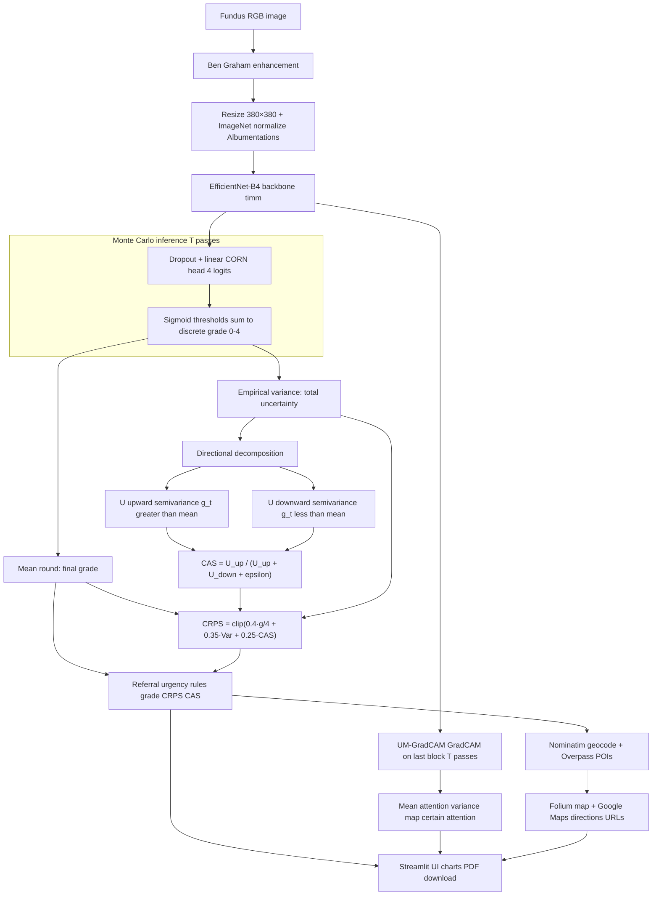

# RetinaScreen: Uncertainty-Aware Diabetic Retinopathy Triage


  


**RetinaScreen** is a research Streamlit application for fundus-image triage in diabetic retinopathy (DR). It couples an **EfficientNet-B4** backbone with a **conditional ordinal (CORN-style)** head, **Monte Carlo dropout** (explicitly enabling both `Dropout` and **DropPath** in `timm`), and **directional uncertainty decomposition (DUD)** to derive a **Clinical Asymmetry Score (CAS)** and **Clinical Risk Priority Score (CRPS)**. The UI adds **uncertainty-modulated Grad-CAM (UM-GradCAM)**, **PDF report export**, and **OpenStreetMap-based** specialist lookup with **Google Maps** direction links.

---

## Abstract

Diabetic retinopathy is graded on an ordered clinical scale (ETDRS-style levels 0–4). Treating grades as unordered classes can waste statistical structure; optimizing only global agreement metrics can overweight the healthy majority. This codebase implements a **CORN ordinal classifier** (four sigmoid thresholds for five grades) on fundus images preprocessed with **Ben Graham contrast enhancement**, **resize to 380×380**, and **ImageNet normalization** (`albumentations`). At inference, **stochastic forward passes** sample dropout and drop-path behaviour to obtain a distribution over discrete grades. From that distribution the app computes **total variance** and **up/down semi-variance** about the mean grade (**U↑**, **U↓**), a **CAS**, and a fixed **linear CRPS** blend used for referral banding. Training uses an asymmetric severity-weighted CORN objective (**ACS-CORN**) in the research pipeline; **the loss itself is not reimplemented in this repository**—only the frozen weights and inference stack are shipped here.

---

## System architecture



---

## Core innovations (code-aligned)

### Ordinal head (CORN)

The classifier outputs **four logits**; each passes through sigmoid and grades are obtained by counting thresholds above 0.5 (`get_grade_from_logits` in `src/model.py`). This matches the **CORN** construction for \(K=5\) ordered classes.

### ACS-CORN (training)

The application and module docstrings describe **Asymmetric Clinical Severity-Weighted CORN (ACS-CORN)** as the training objective used to penalize dangerous confusions (e.g., underestimating proliferative disease) more heavily than benign ones. **Implementation of that loss is outside this repo** (training notebook / experiment code). Inference assumes weights already encode that objective.

### Monte Carlo dropout and DropPath

`enable_mc_dropout` in `src/uncertainty.py` sets the model to `eval()` then forces every submodule whose class name starts with `Dropout` or equals `DropPath` into `train()` mode so **both standard dropout and stochastic depth participate** in forward sampling, consistent with MC dropout practice for `timm` architectures.

### Directional uncertainty decomposition (DUD)

For MC grade samples \(\{g_t\}\) with mean \(\bar g\):

- **U↑** (upward risk): mean of \((g_t - \bar g)^2\) over draws with \(g_t > \bar g\) (severity higher than the mean draw).
- **U↓** (downward risk): mean of \((\bar g - g_t)^2\) over draws with \(g_t < \bar g\).

If one side has no samples, that component is **0** (implementation choice in code).

### Clinical Asymmetry Score (CAS)

\[
\text{CAS} = \frac{U\uparrow}{U\uparrow + U\downarrow + \varepsilon}, \quad \varepsilon = 10^{-8}
\]

Values near **0.5** indicate roughly symmetric spread; **CAS > 0.5** skews toward higher grades relative to the mean sample (under-calling risk in intuitive terms).

### Clinical Risk Priority Score (CRPS)

Implemented as a **bounded linear mixture** of normalized grade, variance, and CAS (`src/uncertainty.py`):

\[
\text{CRPS} = \mathrm{clip}\bigl(0.4 \cdot \frac{g_{\text{final}}}{4} + 0.35 \cdot \mathrm{Var}(g) + 0.25 \cdot \mathrm{CAS},\, 0,\, 1\bigr)
\]

Referral labels **`CLEAR` / `MONITOR` / `ROUTINE` / `PRIORITY` / `URGENT`** are deterministic rules on **`final_grade`**, **CRPS**, and **CAS** (see `_get_urgency` in `src/uncertainty.py`).

### UM-GradCAM

`src/gradcam.py` runs **Grad-CAM** on the **last EfficientNet block** for multiple MC forwards, then aggregates:

- **mean_attention**: average CAM,
- **uncertainty_map**: pixelwise variance across passes,
- **certain_attention**: mean attention down-weighted by normalized variance (\(\text{mean} \times (1 - \text{norm\_var})\)).

---

## Quantitative results

All figures below come from the training and evaluation logs you exported (APTOS protocol unless stated). **Quadratic Weighted Kappa (QWK)** is reported as in those runs.

### Cross-entropy baseline (completed 15 epochs)

Final summary after full training:

| Metric | Value |
|--------|--------|
| **QWK** | **0.9182** |
| **Recall (grades 3 + 4)** | **0.7895** |

So about **21%** of unified severe positives (grades 3 and 4) are **not recalled** at the operating point used in that evaluation, despite strong global QWK.

### RetinaScreen best checkpoint — APTOS test (MC Dropout)

After loading the **best** saved weights (**training QWK at selection: 0.8840**), the **held-out test** evaluation with **Monte Carlo dropout** reports:

| Metric | Value |
|--------|--------|
| **Test QWK** | **0.8978** |

Grade 3+4 recall for this checkpoint was **not** included in the excerpt you provided; add it here when you have the same contingency definition as for the CE baseline.

**Interpretation:** Global QWK is **slightly lower** than the CE baseline (0.9182 → 0.8978), consistent with a deliberate trade-off away from majority-class agreement toward the ordinal / severity-aware training objective used for this checkpoint. **Severe-grade sensitivity** should be compared using the missing recall number once logged.

### Cross-dataset check — Messidor-2

Messidor was **cleaned** first (**687 entries removed** because image files were missing). Then:

| Setting | QWK |
|--------|-----|
| **Messidor-2** (cross-dataset forward pass) | **0.4338** |
| **APTOS test** (same pipeline reference) | **0.8978** |

Your notebook’s rule of thumb—keeping the drop **below ~0.10** QWK when claiming tight generalization—is **not** met here; the gap reflects **domain shift**, **different label definitions / grading scale alignment**, curation (including dropped samples), or other dataset effects. Treat Messidor-2 as a **stress test**, not proof of plug-in clinical deployment on arbitrary fundus data.

---

## Production UI and features

- **Clinical light/dark shell**: `theme_overrides.py` injects scoped CSS; the sidebar toggles `rs_dark_mode`.
- **Inference controls**: adjustable **MC passes** (10–50, default 20), optional **UM-GradCAM** (uses 10 passes in app for latency).
- **Visual analytics**: Plotly **grade mass**, **MC histogram**, **CAS gauge**, and a **radar** of derived screening emphasis indices (functions of grade, CAS, variance, U↑—interpret as UI aids, not independent biomarkers).
- **Preprocessing viewer**: optional **streamlit-image-comparison** slider between raw fundus and Ben Graham preview.
- **PDF report**: **fpdf2** one-page summary with fundus thumbnail, optional mean-attention overlay, grades, urgency, CAS, CRPS, and DUD table (`src/clinical_report.py`).
- **Referral workflow**: for elevated urgency bands, **Nominatim** geocoding plus **Overpass** queries for `healthcare=doctor` with `healthcare:speciality=ophthalmology` and nearby **hospitals**; **Folium** map and **Google Maps** `dir` API-style links (`src/referral.py`).

---

## Installation and quick start

### Clone and virtual environment

```bash
git clone https://github.com/<your-org>/Retina-Screen.git
cd Retina-Screen
python -m venv venv
```

**Windows (PowerShell)**

```powershell
.\venv\Scripts\Activate.ps1
python -m pip install --upgrade pip
pip install -r requirements.txt
```

**macOS / Linux**

```bash
source venv/bin/activate
python -m pip install --upgrade pip
pip install -r requirements.txt
```

### Model weights

**Local:** place **`weights/best_model.pth`** next to `app.py`. The loader accepts checkpoints with `model_state_dict` or a flat state dict.

**Streamlit Cloud / servers without the file:** set **Secrets** so weights download once from the **Hugging Face Hub** (cached under the machine’s HuggingFace cache; the first user after a cold start may wait for download + `st.cache_resource` load).

| Secret | Required | Meaning |
|--------|----------|---------|
| `HF_REPO` | For Hub deploy | e.g. `username/repo` (model repo containing the `.pth`) |
| `HF_MODEL_FILE` | No | Defaults to `weights/best_model.pth` in that repo |
| `HF_TOKEN` | No | Hub token for private repos / rate limits |

Example: copy [`.streamlit/secrets.toml.example`](.streamlit/secrets.toml.example) to `.streamlit/secrets.toml` locally (never commit).

### Deploy to Streamlit Community Cloud

1. Push this repository to **GitHub** (without `*.pth`; keep weights on Hub or ignore the rule only on a private fork if you must vendor files).
2. Upload **`best_model.pth`** to a **Hugging Face model repo** (same path as `HF_MODEL_FILE`, e.g. `weights/best_model.pth`).
3. Open [share.streamlit.io](https://share.streamlit.io) → **New app** → select the repo, branch, and main file **`app.py`**.
4. **Advanced settings:** choose **Python 3.10** or **3.11** (match your training stack if possible).
5. **Secrets** → paste:
   ```toml
   HF_REPO = "your-username/your-retinascreen-weights"
   HF_MODEL_FILE = "weights/best_model.pth"
   ```
   Add `HF_TOKEN = "hf_..."` if the Hub repo is private.
6. **Deploy.** First build installs PyTorch and dependencies (several minutes). First **model load** after deploy downloads weights once; `@st.cache_resource` keeps the model in memory for that container until it sleeps (Community Cloud recycles machines—you may see occasional repeat downloads).
7. **Latency expectations:** inference is **CPU-only** on free tier; EfficientNet-B4 + 20× MC dropout + optional Grad-CAM is intentionally heavy. Expect **tens of seconds** per image on cold start or busy hardware; reduce MC passes in the sidebar for demos.

**Alternatives if you outgrow Community Cloud:** Streamlit in **Docker** on a VM with GPU; **Private Cloud** / **Teams** with more RAM and pinned hardware; or a thin **FastAPI** backend that keeps the model warm.

### Run locally

```bash
streamlit run app.py
```

---

## Repository structure

```text
Retina-Screen/
├── app.py                 # Streamlit entrypoint
├── theme_overrides.py     # Light/dark theme injections
├── requirements.txt
├── config.toml            # Project / tooling config (if used locally)
├── .streamlit/
│   ├── config.toml              # Theme, max upload size
│   └── secrets.toml.example     # Template for HF_REPO (copy → secrets.toml)
├── assets/
│   └── style.css          # Clinical UI styling
├── weights/               # best_model.pth (not committed)
│   └── best_model.pth
└── src/
    ├── model.py           # RetinaScreenModel EfficientNet-B4 + preprocess
    ├── uncertainty.py     # MC dropout DUD CAS CRPS urgency
    ├── gradcam.py         # UM-GradCAM
    ├── referral.py        # Nominatim Overpass Folium Google Maps links
    └── clinical_report.py # PDF export
```

---

## Dependencies (pinned excerpt)

Key runtime packages are pinned in `requirements.txt`, including **Streamlit 1.35**, **PyTorch 2.1**, **timm**, **albumentations**, **grad-cam**, **plotly**, **folium**, **streamlit-folium**, **fpdf2**, and **streamlit-image-comparison**.

---

## Disclaimer

This software is a **research and educational prototype**. It is **not** an FDA-cleared or CE-marked medical device and **must not** be used as the sole basis for diagnosis, treatment, or referral decisions. Clinical correlation and qualified eye-care evaluation remain mandatory.

---